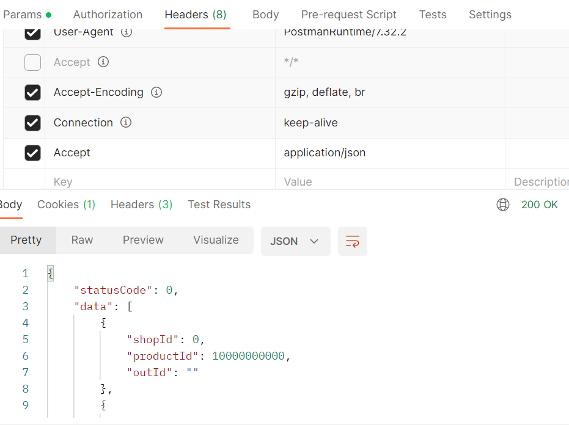
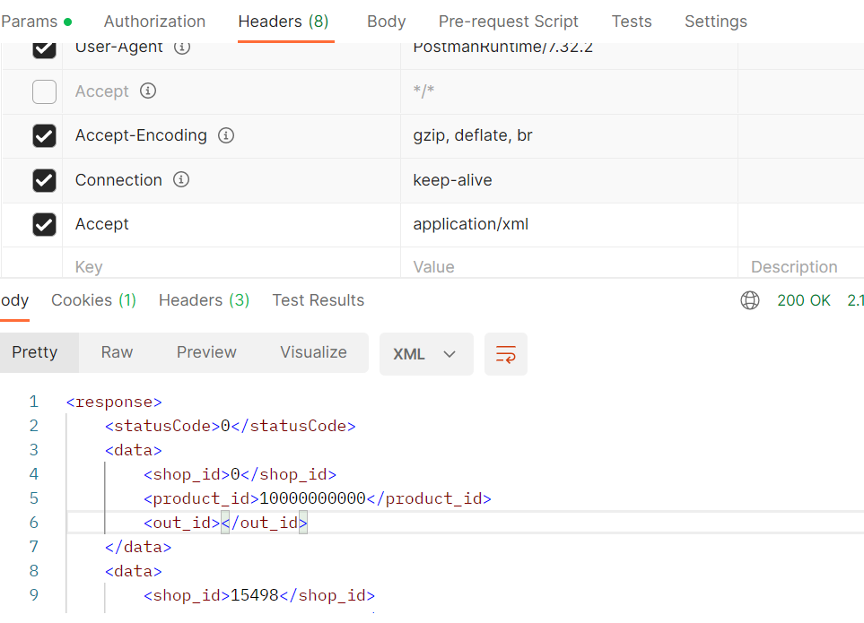
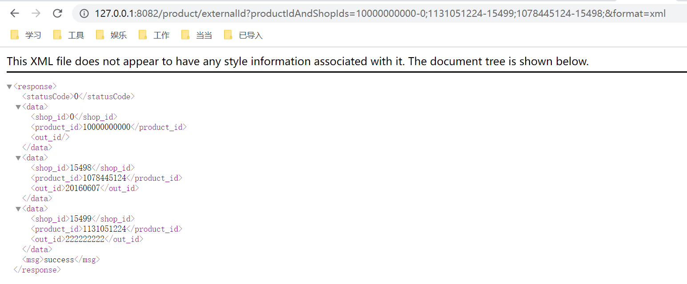
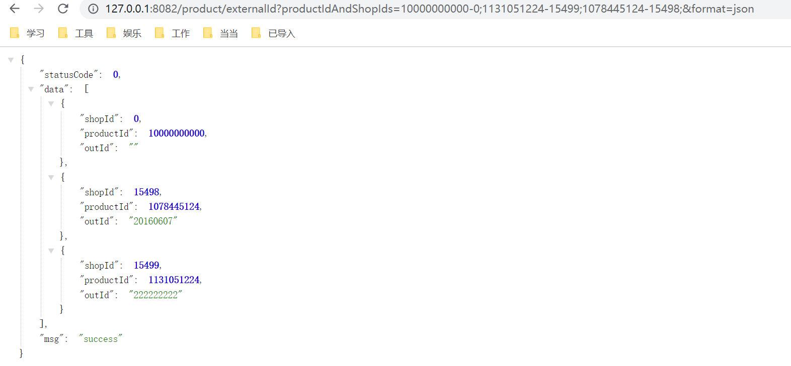

SpringBoot接口直接XML及JSON序列化的三种方式

增加XML序列化依赖,不用增加版本信息,在SpringMvc包中已经引入过了该依赖。只需要告诉项目当前模块需要引入依赖就会从父类继承。

```
        <dependency>
            <groupId>com.fasterxml.jackson.dataformat</groupId>
            <artifactId>jackson-dataformat-xml</artifactId>
        </dependency>
```

1. 根据请求路径的后缀匹配进行对应的序列化
2. 根据请求参数来进行序列化
3. 根据请求头这中Accept参数来进行序列化

前两种方式Spring中默认为关闭状态，如果需要使用则需要进行配置：

- 通过实现WebMvcConfigurer接口实现configureContentNegotiation方法

```java

@Configuration
public class WebRespConfig implements WebMvcConfigurer {

    public void configureContentNegotiation(ContentNegotiationConfigurer configurer) {
        configurer.favorPathExtension(true)                         // 通过请求路径后缀实现不同的序列化
                .favorParameter(true)                               // 通过请求参数实现不同的序列化 
                .parameterName("format")                            // 序列化方式的请求参数-默认为format
                .defaultContentType(MediaType.APPLICATION_JSON);    // 设置默认序列化方式
    }
}
```

- 继承WebMvcConfigurationSupport重新configureContentNegotiation方法即可

```java

@Configuration
public class WebRespConfig extends WebMvcConfigurationSupport {

    @Override
    protected void configureContentNegotiation(ContentNegotiationConfigurer configurer) {
        configurer.favorParameter(true)
                .parameterName("format")
                .defaultContentType(MediaType.APPLICATION_ATOM_XML);
    }
}
```

- 配置yml文件或者properties文件

```yaml
spring:
  mvc:
    content negotiation:
      # 配置根据请求路径后缀序列化
      favor-path-extension: true
      # 后缀对应的的序列化方式
      media-types:
        json: application/json
        xml: application/xml
      # 配置是否根据请求参数进行序列化
      favor-parameter: true
      # 参数的名称 默认为 format
      parameter-name: format
```

XML对象自定义格式化：
```java
@JacksonXmlRootElement(localName ="item")
public class ResultVo{
    
    @JacksonXmlProperty(localName = "p1")
    private String filed1;

    @JacksonXmlProperty(localName = "p2")
    private Long filed2;

    @JacksonXmlProperty(localName = "p3")
    private SubjectVo filed3;
}
```

示例    
使用请求头的Accept内容：    
    

使用请求参数进行序列化：    
    
